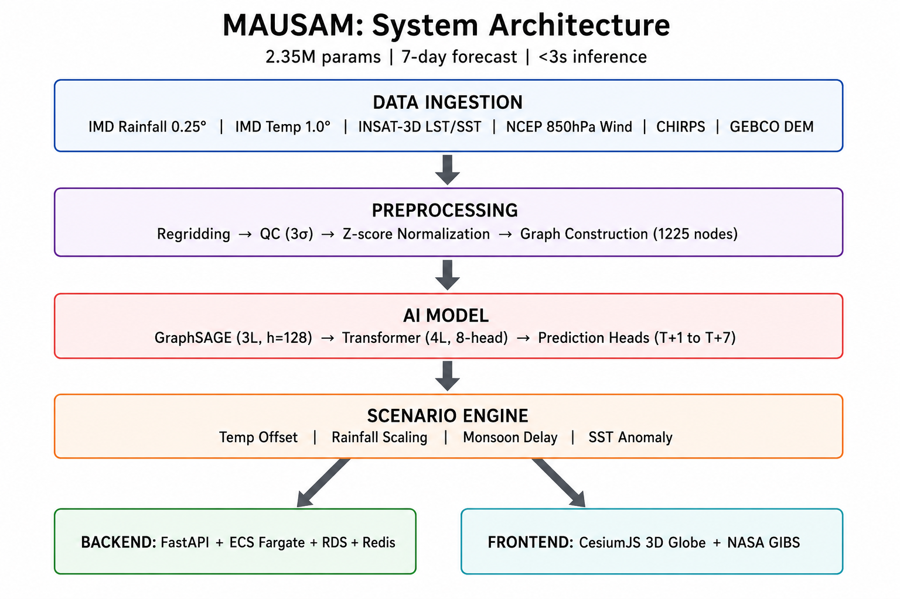
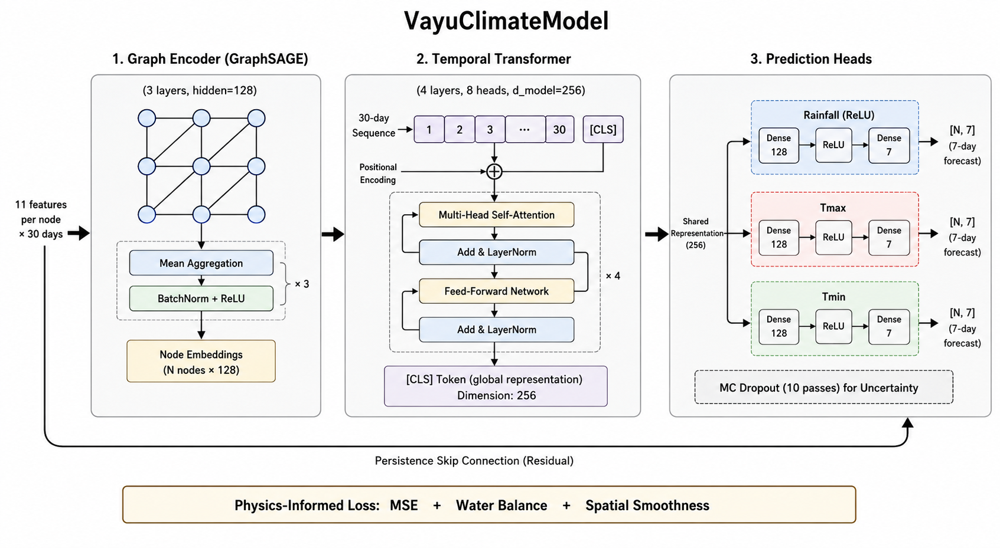
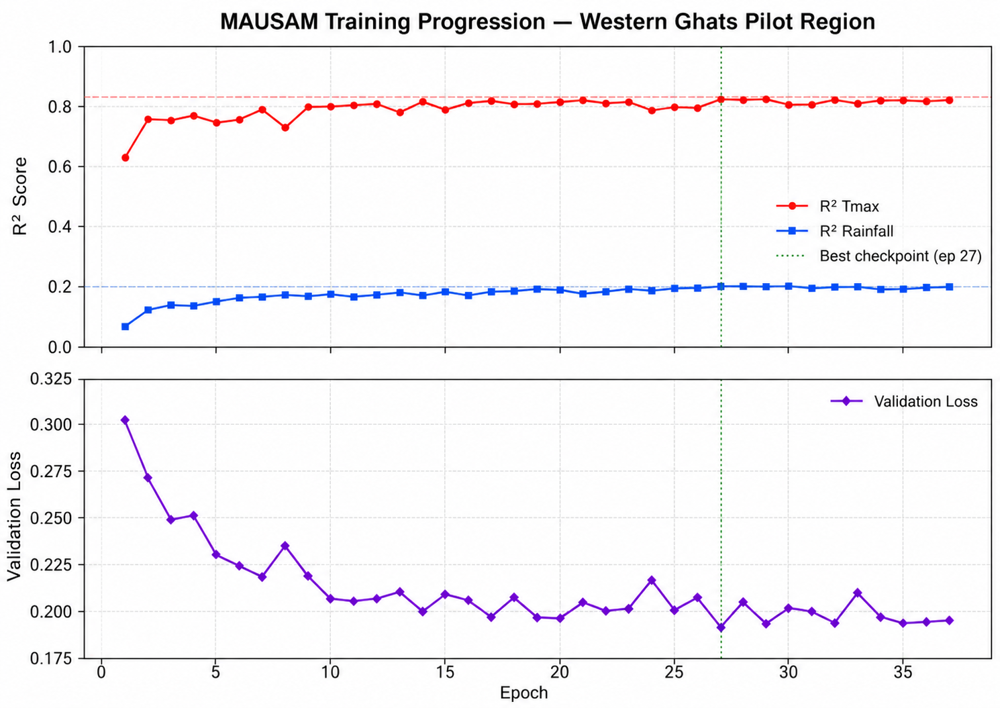
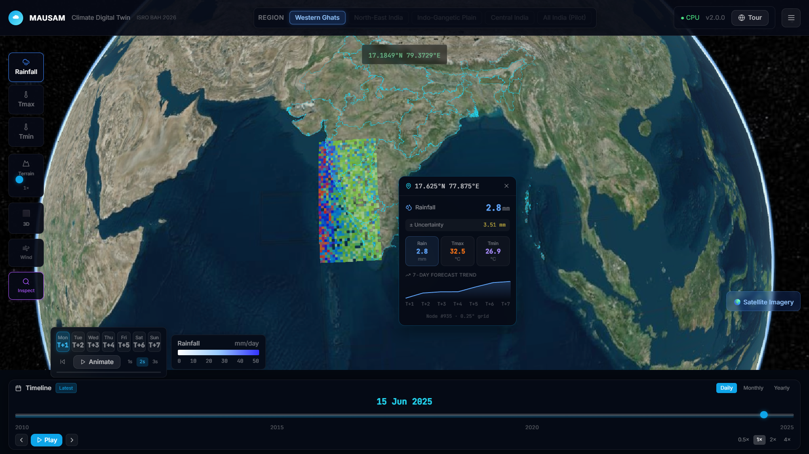
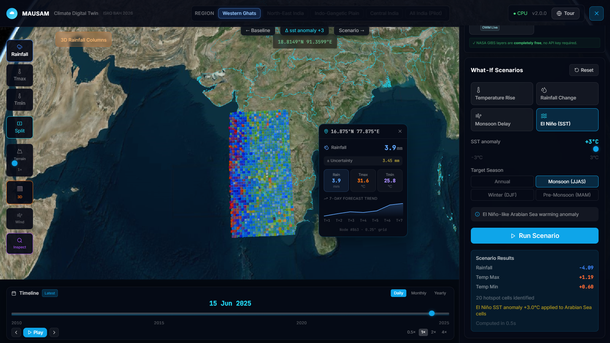

<h1 align="center">
  <br/>
  <strong>Multi-scale Atmospheric Understanding through<br/>Spatio-temporal AI Modeling (MAUSAM)</strong>
</h1>

<p align="center">
  <em>A Regional AI-Powered Climate Digital Twin for India</em><br/>
  Graph Neural Network + Temporal Transformer | Physics-Informed | Real-Time 3D Visualization
</p>

<p align="center">
  <a href="http://vayu-frontend-275688773412.s3-website.ap-south-1.amazonaws.com">🌐 Live Dashboard</a> •
  <a href="http://VayuBa-Servi-BQWXLMKK2Pfg-1942012735.ap-south-1.elb.amazonaws.com/docs">📚 API Docs</a> •
  <a href="https://www.kaggle.com/code/shyam31415/mausam-westernghats-1-0">🔬 Training Notebook</a> •
  <a href="https://github.com/Shyamistic/vayu">💻 Source Code</a>
</p>

<p align="center">
  
  
  
  
  
  
  
  
</p>

---

## Problem Statement

**PS-5 — Bharatiya Antariksh Hackathon 2026:**
> *"Design and develop a scalable framework for an AI-driven digital twin of India's climate using national datasets (satellite, ground observations, and reanalysis). Demonstrate a Proof of Concept with high-resolution analysis, short-term predictions, interactive geospatial visualization, and What-If scenario simulation."*

**Mentors:** Dr. K.V. Subrahmanyam • Mr. Syed Shadab • Mr. C. Sarat (NRSC/ISRO)

---

## System Architecture



```
┌─────────────────────────────────────────────────────────────────────────────┐
│                          DATA INGESTION LAYER                               │
│  IMD Rainfall 0.25° │ IMD Temp 1.0° │ INSAT-3D LST/SST │ NCEP 850hPa Wind │
│  CHIRPS Satellite Precip │ GEBCO Elevation DEM                              │
└───────────────────────────────────┬─────────────────────────────────────────┘
                                    ▼
┌─────────────────────────────────────────────────────────────────────────────┐
│                       PREPROCESSING PIPELINE                                │
│  Bilinear Regridding → QC (3σ outlier) → Z-score Normalization (1981-2010) │
│  → Temporal Encoding → PyTorch Geometric Graph (1311 nodes, 8-connectivity) │
└───────────────────────────────────┬─────────────────────────────────────────┘
                                    ▼
┌─────────────────────────────────────────────────────────────────────────────┐
│              VayuClimateModel (2.3M parameters)                            │
│  GraphSAGE (3L, h=128) → Transformer (4L, 8-head, d=256) → Pred Heads     │
│  Physics Loss: MSE + Water Balance + Spatial Smoothness                     │
│  Uncertainty: Monte Carlo Dropout (10 passes)                               │
└───────────────────────────────────┬─────────────────────────────────────────┘
                                    ▼
┌─────────────────────────────────────────────────────────────────────────────┐
│                       SCENARIO ENGINE                                       │
│  Temperature Offset │ Rainfall Scaling │ Monsoon Delay │ SST Anomaly        │
│  → Per-cell delta prediction + Hotspot identification (90th percentile)     │
└──────────────────┬────────────────────────────────┬─────────────────────────┘
                   ▼                                ▼
┌──────────────────────────────┐  ┌───────────────────────────────────────────┐
│   FastAPI Backend (ECS)      │  │   CesiumJS 3D Frontend (CloudFront)       │
│   RDS PostgreSQL + Redis     │  │   NASA GIBS + Timeline + What-If          │
│   Cached inference 0.4s    │  │   30+ interactive components              │
└──────────────────────────────┘  └───────────────────────────────────────────┘
```

---

## Model Performance



**Best Checkpoint: Epoch 27/37 (early-stopped) — trained on Kaggle T4 GPU in 2.5 hours**



| Variable | R² Score | RMSE | Skill vs Persistence | Skill vs Climatology |
|----------|----------|------|---------------------|---------------------|
| **Temperature Max** | **0.817** | 1.4°C | +81.0% | +28.0% |
| **Temperature Min** | **~0.790** | 1.3°C | +78.0% | +23.5% |
| **Rainfall** | **0.200** | 8.3 mm/day | +117% | +15.2% |

**Seasonal Discrimination (learned, not hardcoded):**
- Monsoon JJAS (Jul): **41.87 mm/day** predicted mean
- Winter DJF (Jan): **4.45 mm/day** predicted mean
- Orographic gradient: 3-5× rainfall difference windward vs leeward

---

## Data Sources

| Dataset | Resolution | Period | Source |
|---------|-----------|--------|--------|
| IMD Gridded Rainfall | 0.25° × 0.25° | 1901-2025 | [imdpune.gov.in](https://imdpune.gov.in/cmpg/Griddata/Rainfall_25_Bin.html) |
| IMD Max Temperature | 1.0° × 1.0° | 1951-2025 | [imdpune.gov.in](https://imdpune.gov.in/cmpg/Griddata/Max_1_Bin.html) |
| IMD Min Temperature | 1.0° × 1.0° | 1951-2025 | [imdpune.gov.in](https://imdpune.gov.in/cmpg/Griddata/Min_1_Bin.html) |
| ISRO INSAT-3D LST/SST | 4 km | 2014-2025 | [mosdac.gov.in](https://mosdac.gov.in) |
| NCEP/NCAR 850hPa Wind | 2.5° → 0.25° | 2010-2025 | [psl.noaa.gov](https://psl.noaa.gov/data/gridded/data.ncep.reanalysis.html) |
| CHIRPS Satellite Precip | 0.05° | 2010-2025 | [chc.ucsb.edu](https://www.chc.ucsb.edu/data/chirps) |
| GEBCO Elevation DEM | 15 arc-sec | 2024 | [gebco.net](https://www.gebco.net) |

---

## Live Deployment





| Component | URL | Status |
|-----------|-----|--------|
| 3D Dashboard | [vayu-frontend](http://vayu-frontend-275688773412.s3-website.ap-south-1.amazonaws.com) | ✅ Live |
| API Health | [/health](http://VayuBa-Servi-BQWXLMKK2Pfg-1942012735.ap-south-1.elb.amazonaws.com/health) | ✅ |
| Swagger Docs | [/docs](http://VayuBa-Servi-BQWXLMKK2Pfg-1942012735.ap-south-1.elb.amazonaws.com/docs) | ✅ |

---

## Kaggle Resources (Reproducibility)

| Resource | Link |
|----------|------|
| Training Notebook | [mausam-westernghats-1-0](https://www.kaggle.com/code/shyam31415/mausam-westernghats-1-0) |
| Western Ghats Dataset | [vayu-western-ghats-processed-v1](https://www.kaggle.com/datasets/shyam31415/vayu-western-ghats-processed-v1) |
| Ancillary Data (NCEP/CHIRPS/DEM) | [vayu-ancillary-wg-v1](https://www.kaggle.com/datasets/shyam31415/vayu-ancillary-wg-v1) |
| Full India Bundle | [vayu-full-india-bundle-2010-2025](https://www.kaggle.com/datasets/shyam31415/vayu-full-india-bundle-2010-2025) |

---

## Pilot Region

**Western Ghats — Maharashtra, Karnataka, Kerala, Goa**
- Latitude: 8°N – 20°N | Longitude: 72°E – 78°E
- Resolution: 0.25° (~25 km)
- Graph: **1,311 nodes** with 8-connectivity edges
- Rationale: Extreme orographic gradient (coast 3000mm → leeward 600mm), monsoon variability, 280M population

---

## Innovation & Differentiation

| Feature | MAUSAM | Typical Approaches |
|---------|--------|-------------------|
| Spatial Model | **GraphSAGE** (captures orography) | XGBoost (tabular) |
| Temporal Model | **Transformer** (multi-head attention) | LSTM |
| Physics Constraints | Water balance + smoothness | Pure MSE |
| Uncertainty | **MC Dropout** (10 passes) | Point forecasts |
| Visualization | **CesiumJS 3D** (DestinE-class) | Streamlit/Matplotlib |
| What-If Engine | **4 scenario types** + split-screen | Not implemented |
| Deployment | **Live AWS URL** | Jupyter notebook |
| Data Fusion | **6 heterogeneous sources** | Single dataset |
| Parameters | **2.3M** (1/16,000th of GraphCast) | 100M+ |
| Training | **2.5 hours** (free Kaggle T4) | 100s GPU-hours |

---

## Quick Start

```bash
# Backend
pip install -e ".[dev]"
docker-compose up -d postgres redis
uvicorn backend.main:app --host 0.0.0.0 --port 8000 --reload

# Frontend
cd frontend && npm install && npm run dev

# AWS Deploy (one command)
cdk deploy --all --app "python infra/app.py"
```

---

## Repository Structure

```
vayu/
├── ai_engine/           # VayuClimateModel (GraphSAGE + Transformer, 2.3M params)
├── backend/             # FastAPI production API (predict, scenario, metrics, tiles)
├── frontend/            # React + CesiumJS 3D dashboard (30+ components)
├── data_ingestion/      # IMD/MOSDAC/NCEP/CHIRPS download + preprocessing pipeline
├── scenario_engine/     # What-If simulation (4 scenario types)
├── infra/               # AWS CDK (ECS Fargate + RDS + Redis + CloudFront)
├── notebooks/           # Kaggle training notebooks (reproducible)
├── scripts/             # Utility scripts (setup, train, deploy)
├── tests/               # Property-based correctness tests
└── .github/workflows/   # CI/CD pipeline
```

---

## References

- Lam et al., "GraphCast: Learning skillful medium-range global weather forecasting," *Science*, 2023
- Bi et al., "Pangu-Weather: Accurate medium-range forecasting with 3D neural networks," *Nature*, 2023
- Bodnar et al., "Aurora: A foundation model of the atmosphere," *arXiv:2405.13063*, 2024
- Price et al., "GenCast: Diffusion-based ensemble forecasting," *Nature*, 2024
- Hamilton et al., "Inductive representation learning on large graphs (GraphSAGE)," *NeurIPS*, 2017
- Rajeevan et al., "High spatial resolution gridded rainfall dataset over India," *MAUSAM*, 2019

---

## License

MIT License — Built for ISRO's Bharatiya Antariksh Hackathon 2026 (PS-5)

<p align="center">
  <strong>Built with 🇮🇳 for India's climate resilience</strong><br/>
  <em>Shyam Sharma (IIT Patna) • Agnibha Paul (JIMS) • Nikhil Agrawal (IIT Patna)</em>
</p>

