<h1 align="center">
  <br/>
  <strong>MAUSAM / VAYU</strong><br/>
  <sub>Multi-scale Atmospheric Understanding through Spatio-temporal AI Modeling</sub>
</h1>

<p align="center">
  <em>An AI-powered climate digital twin for India</em><br/>
  Graph Neural Network + Temporal Transformer &nbsp;|&nbsp; 45 years of harmonised observations &nbsp;|&nbsp; Interactive 3D twin &nbsp;|&nbsp; Counterfactual What-If engine
</p>

<p align="center">
  
  
  
  
  
  
  
  
  
</p>

<p align="center">
  <a href="#quick-start-run-it-on-any-machine">▶ Run it</a> •
  <a href="#end-to-end-reproduction-for-reviewers">🔬 Reproduce E2E</a> •
  <a href="#architecture">🏗 Architecture</a> •
  <a href="#validation-and-measured-results">📊 Validation</a> •
  <a href="#trained-models-in-this-repository">🧠 Models</a> •
  <a href="#kaggle-datasets-and-training-notebooks">📦 Kaggle</a>
</p>

---

## Read this first — how we report numbers

Every figure in this README was **re-measured on 2026-08-07** against the code in this
commit. Three conventions we hold to, because they are the difference between a
validation and a highlight reel:

1. **We publish the baseline floor next to every score.** A day-of-year climatology
   lookup blended with yesterday's observation already reaches R²_rain ≥ 0.20 and
   R²_tmax ≥ 0.80 in three of four regions. So a raw R² is not evidence of a working
   model — only the **margin over that floor** is. Both columns are in
   [the results table](#per-region-test-set-results-on-2023-2025-never-seen-in-training).
2. **We report where we lose.** Temperature beats persistence and climatology
   individually by wide margins but **loses to the optimally tuned blend of the two**
   by −0.003 to −0.060. That is in the table too.
3. **We do not claim a live public URL.** The stack is containerized with a written
   AWS CDK stack, but public cloud hosting is **not live**. It runs end-to-end
   locally, which is what the instructions below reproduce.

Deprecated endpoints that return hardcoded literals (`/api/metrics`,
`/api/verification-scores`, `/api/flood-events`) are documented as such in
[the API surface](#api-surface) — do not cite them.

---

## Problem statement

**PS-5 — Bharatiya Antariksh Hackathon 2026:**
> Design and develop a scalable framework for an AI-driven digital twin of India's
> climate using national datasets (satellite, ground observations, and reanalysis).
> Demonstrate a Proof of Concept with high-resolution analysis, short-term
> predictions, interactive geospatial visualization, and What-If scenario simulation.

**Mentors:** Dr. K.V. Subrahmanyam • Mr. Syed Shadab • Mr. C. Sarat (NRSC/ISRO)

### What "digital twin" means here, concretely

| Layer | What it is | State | Artifact |
|---|---|---|---|
| **1. Observed** | 45 years harmonised — 6 sources, 17 channels, one grid | **BUILT** | 16,436 consecutive days, zero missing |
| **2. Predicted** | 7-day daily forecast, 3 variables, per cell, MC-dropout uncertainty | **BUILT** | 5 trained checkpoints in this repo |
| **3. Counterfactual** | 6 perturbations answered from the observed record | **BUILT** | `scenario_engine/`, `backend/sensitivity.py` |
| 4. Impact sectors | UHI, air quality, carbon, energy, urban logistics | **ROADMAP** | designed, not trained |

---

## Architecture


The system deliberately **forks into two independent paths** after the shared data
layer. This is the single most important design decision in the project:

```
 ┌──────────────────────────────────────────────────────────────────────────────┐
 │  1. INGESTION — 6 independent sources, native resolutions                    │
 │     IMD rainfall 0.25° · IMD tmax/tmin 1.0° · ERA5-Land skin T · NOAA OISST  │
 │     NCEP/NCAR 850 hPa (u, v, q) · CHIRPS 0.05° · GEBCO DEM                   │
 │     data_ingestion/{imd_downloader,era5,oisst,ncep,chirps,static_rasters}.py  │
 └──────────────────────────────────┬───────────────────────────────────────────┘
                                    ▼
 ┌──────────────────────────────────────────────────────────────────────────────┐
 │  2. HARMONISATION — data_ingestion/preprocessor.py                           │
 │     bilinear/area-average regrid to one target grid · QC (3σ) ·               │
 │     per-cell z-score on 1981–2010 · explicit missingness indicator channels   │
 │     → 16,436 consecutive daily timesteps, 1981-01-01 → 2025-12-31, zero gaps  │
 └──────────────────────────────────┬───────────────────────────────────────────┘
                                    ▼
 ┌──────────────────────────────────────────────────────────────────────────────┐
 │  3. GRAPH — data_ingestion/graph_builder.py                                  │
 │     8-connectivity lattice. 3 physics edge features per edge:                 │
 │       (a) great-circle distance   (b) orographic gradient Δelevation          │
 │       (c) wind alignment cos(θ_edge − MONSOON_WIND_DIR), MONSOON_WIND_DIR=π/4 │
 └───────────────┬──────────────────────────────────────────────┬───────────────┘
                 ▼ FORECAST PATH                                ▼ WHAT-IF PATH
 ┌───────────────────────────────────────────┐  ┌──────────────────────────────────┐
 │ 4a. VayuClimateModel — 6,561,435 params   │  │ 4b. Sensitivity engine           │
 │  GraphSAGE 3L, h=192, dropout 0.12        │  │  backend/sensitivity.py          │
 │    → 227,520 params                       │  │  Per-cell OLS on 45 observed     │
 │  time-batched: ONE message-passing call   │  │  JJAS seasons. Reports slope,    │
 │    over N·30 nodes, not 30 passes         │  │  r², p, n, SE, 95% CI.           │
 │  Transformer 5L, 8-head, d=384, ff=768    │  │  NEVER touches the neural net —  │
 │    + CLS token → 5,994,624 params         │  │  a counterfactual must come from │
 │  3 residual heads → 339,291 params        │  │  observation, not from a model   │
 │    pred = w_persist·persistence           │  │  extrapolating outside its       │
 │         + w_clim·climatology              │  │  training distribution.          │
 │         + zero-init residual              │  └──────────────┬───────────────────┘
 │  MC-dropout ×10 for uncertainty           │                 │
 │  Loss: pure MSE (both physics λ = 0.0 —   │                 │
 │        see "Bugs we found", finding #1)   │                 │
 │  (N,30,17) → (N,30,192) → (N,31,384)      │                 │
 │           → CLS (N,384) → 3 × (N,7)       │                 │
 └───────────────┬───────────────────────────┘                 │
                 ▼                                             ▼
 ┌──────────────────────────────────────────────────────────────────────────────┐
 │  5. SERVE — FastAPI (backend/main.py, 32 routes) + PostGIS + Redis cache      │
 │     EnKF assimilation (backend/enkf.py) fuses live sensor ↔ model forecast     │
 │     Fail-closed SQL constraint rejects synthetic data at the ingestion edge    │
 └──────────────────────────────────┬───────────────────────────────────────────┘
                                    ▼
 ┌──────────────────────────────────────────────────────────────────────────────┐
 │  6. TWIN UI — React + TypeScript + CesiumJS 3D globe                          │
 │     forecast layers · timeline · What-If studio · ERA5 validation panel        │
 │     IoT station pins · offline PWA · export (PNG/CSV/GeoJSON/PDF)              │
 └──────────────────────────────────────────────────────────────────────────────┘
```

### Model internals


`ai_engine/config.py :: ModelConfig` — the authoritative source for every number below.

| Component | Setting | Params |
|---|---|---|
| Input features / node | `gnn_in_features = 17` | — |
| GraphSAGE encoder | `hidden = 192`, `layers = 3`, `dropout = 0.12` | 227,520 |
| Temporal transformer | `d_model = 384`, `nhead = 8`, `layers = 5`, `ff = 768`, `dropout = 0.1` | 5,994,624 |
| Prediction heads (×3) | residual over persistence/climatology blend | 339,291 |
| Input window | `input_window = 30` days | — |
| Forecast horizon | `forecast_horizon = 7` days | — |
| Targets | `rainfall`, `tmax`, `tmin` | — |
| Uncertainty | `mc_dropout_passes = 10` | — |
| Physics penalties | `lambda_conservation = 0.0`, `lambda_smoothness = 0.0` — **both deliberately off** | — |
| **Total** | verified by `sum(p.numel() for p in model.parameters())` | **6,561,435** |

> **On the physics loss:** earlier versions of this README claimed "water balance +
> spatial smoothness" penalties. Both are **0.0 in code, on purpose.** The
> conservation term `|mean(pred) − mean(true)|` is minimised by predicting the mean,
> which is exactly the R²_rain → 0.000 collapse we measured. The smoothness term
> penalises adjacent-node temperature differences, but real terrain-driven gradients
> are large and physical, so it suppressed the very spatial variance R²_tmax scores.
> Physics enters this model through the **graph edge features**, not the loss.

### The graphs, measured

| Region | Bounds (lat, lon) | Grid | Nodes | Edges |
|---|---|---|---|---|
| `western_ghats` | 7.5–21.5 N, 72.0–77.5 E | 57 × 23 | 1,311 | 10,012 |
| `north_east_india` | 22.0–29.5 N, 88.0–97.5 E | 31 × 39 | 1,209 | 9,256 |
| `indo_gangetic_plain` | 23.0–31.5 N, 74.0–89.5 E | 35 × 63 | 2,205 | 17,056 |
| `central_india` | 17.0–25.5 N, 74.0–84.5 E | 35 × 43 | 1,505 | 11,576 |
| `full_india` (0.5°) | 6.625–38.125 N, 66.625–99.625 E | 64 × 67 | **4,288** | 33,522 |

Regional bounds are declared in `ai_engine/regions.py :: REGION_BOUNDS`.

**Why the national model is 0.5° and not 0.25°** — an engineering constraint, stated
plainly: full India at 0.25° is 129 × 137 = 17,673 nodes ≈ **19.8 GB dense**, against a
build machine with 15.3 GB RAM and a Kaggle session limit. Regional models stay at
0.25°; the national grid is the coverage demonstration.

**Why regional models at all** — the four regions are measurably different climate
regimes, not an arbitrary split. The optimal rainfall persistence weight the models
learn spans 0.10–0.20 and the rainfall baseline floor spans +0.191 to +0.263 across
them. One 0.25° national model would have to reconcile the Western Ghats' 1-day
orographic response with the IGP's multi-day synoptic one.

---

## Data foundation

### The 17 input channels

Declared in `data_ingestion/graph_builder.py :: BASE_FEATURE_NAMES`, assembled per
timestep into an `(N, 30, 17)` tensor.

| # | Channel | Source | Role |
|---|---|---|---|
| 0 | `rainfall` | IMD gridded daily 0.25° | **target** + input |
| 1 | `tmax` | IMD gridded daily 1.0° | **target** + input |
| 2 | `tmin` | IMD gridded daily 1.0° | **target** + input |
| 3 | `insat_lst` | **ERA5-Land skin temperature** | ⚠ **SUBSTITUTE** — see below |
| 4 | `insat_sst` | **NOAA OISST v2.1** | ⚠ **SUBSTITUTE** — see below |
| 5 | `day_sin` | derived | annual cycle encoding |
| 6 | `day_cos` | derived | annual cycle encoding |
| 7 | `jjas_flag` | derived | monsoon season indicator |
| 8 | `monsoon_progress` | derived | position within monsoon |
| 9 | `uwnd_850` | NCEP/NCAR 850 hPa | zonal wind |
| 10 | `vwnd_850` | NCEP/NCAR 850 hPa | meridional wind |
| 11 | `shum_850` | NCEP/NCAR 850 hPa | specific humidity |
| 12 | `chirps_rain` | CHIRPS 0.05° | auxiliary satellite precip (**not** a target) |
| 13 | `elevation` | GEBCO DEM | static |
| 14 | `land_sea_mask` | GEBCO DEM | static |
| 15 | `lat_norm` | derived | static position |
| 16 | `lon_norm` | derived | static position |

Six optional `*_missing` indicator channels (`MISSINGNESS_FEATURE_NAMES`) can be
appended so the model can distinguish "zero" from "absent" rather than inferring it.

### Substitution disclosure — stated up front, not in a footnote

The channels are **named** `insat_lst` and `insat_sst` because INSAT-3D was the
intended source. **MOSDAC data access was never approved for this project.** Rather
than ship empty channels or fabricate them, we substituted physically equivalent
open reanalysis/analysis products and kept the original channel names so the
substitution is impossible to miss in the code:

| Channel | Intended | **Actually used** |
|---|---|---|
| `insat_lst` | INSAT-3D L2B LST, 4 km | **ERA5-Land skin temperature** |
| `insat_sst` | INSAT-3D L2B SST, 4 km | **NOAA OISST v2.1** |

This also means those two channels are **disqualified as independent validation
references** — validating an ERA5-derived channel against ERA5 is circular. The
[ERA5 validation module](#independent-validation-against-era5) enforces this in code
via a `CIRCULAR_VARIABLES` guard that refuses the comparison.

### Sources

| Dataset | Resolution | Period used | Source |
|---|---|---|---|
| IMD gridded rainfall | 0.25° | 1981–2025 | [imdpune.gov.in](https://imdpune.gov.in/cmpg/Griddata/Rainfall_25_Bin.html) |
| IMD max temperature | 1.0° | 1981–2025 | [imdpune.gov.in](https://imdpune.gov.in/cmpg/Griddata/Max_1_Bin.html) |
| IMD min temperature | 1.0° | 1981–2025 | [imdpune.gov.in](https://imdpune.gov.in/cmpg/Griddata/Min_1_Bin.html) |
| ERA5-Land skin temperature | 0.1° | 1981–2025 | [Copernicus CDS](https://cds.climate.copernicus.eu) |
| NOAA OISST v2.1 | 0.25° | 1981–2025 | [ncei.noaa.gov](https://www.ncei.noaa.gov/products/optimum-interpolation-sst) |
| NCEP/NCAR 850 hPa u, v, q | 2.5° → regridded | 1981–2025 | [psl.noaa.gov](https://psl.noaa.gov/data/gridded/data.ncep.reanalysis.html) |
| CHIRPS satellite precipitation | 0.05° | 1981–2025 | [chc.ucsb.edu](https://www.chc.ucsb.edu/data/chirps) |
| GEBCO elevation DEM | 15 arc-sec | 2024 | [gebco.net](https://www.gebco.net) |
| ERA5 reanalysis (validation only) | 0.25° | on-demand | Open-Meteo ERA5 archive API |

### Temporal split — no leakage

| Split | Years | Note |
|---|---|---|
| Train | **1981–2021** | |
| Validation | **2022** | early-stopping signal only |
| Test | **2023–2025** | **never seen during training**; all reported results are on this |

> `ai_engine/config.py :: DataSplit` still carries a stale 1951/2021/2024 split. It is
> **unused by the training path** and is scheduled for removal. The split above is the
> one the trainer actually applies.

---

## Validation and measured results

### Per-region test-set results on 2023-2025 (never seen in training)

**Read the `floor` columns.** `floor` is a day-of-year climatology lookup blended with
yesterday's observation, weight-optimised per region by
`scripts/skill_ceiling_probe.py`. **Δ is the only column that is evidence of a model.**

| Region | rain R² | floor | **Δ rain** | tmax R² | floor | Δ tmax | tmin R² | floor | Δ tmin |
|---|---|---|---|---|---|---|---|---|---|
| Western Ghats | 0.254 | 0.235 | **+0.019** ✅ | 0.804 | 0.807 | −0.003 | 0.826 | 0.818 | **+0.008** ✅ |
| North East India | 0.219 | 0.201 | **+0.018** ✅ | 0.719 | 0.753 | −0.034 | 0.951 | 0.959 | −0.008 |
| Indo-Gangetic Plain | 0.228 | 0.191 | **+0.037** ✅ | 0.857 | 0.893 | −0.036 | 0.936 | 0.944 | −0.008 |
| Central India | 0.257 | 0.263 | −0.006 | 0.819 | 0.879 | −0.060 | 0.893 | 0.905 | −0.012 |
| Full India (0.5°) | 0.234 | 0.230 | **+0.004** ✅ | 0.835 (val) | — | — | — | — | — |

**What this table says, honestly:**

- **Rainfall beats the floor in 3 of 4 regions** on untouched test years. Beating
  persistence on Indian daily rainfall is a published-as-hard result, and the margin
  is small but real.
- **Temperature loses to the tuned blend in every region** by −0.003 to −0.060. We
  report this because a validation that only shows wins is not a validation. Note the
  floor itself is at 0.75–0.89 — the headroom above a day-of-year lookup for Indian
  daily temperature is genuinely thin.
- ⚠ **The frequently-quoted "0.89 tmax" and "0.83+ tmax" figures in this repo's older
  documents are FLOORS, not model scores.** Every regional tmax number appears twice —
  once as a floor, once as a result — within 0.06 of each other. Always check the label.

### Against each baseline individually

Temperature beats each single baseline by a wide, measured margin. It is only their
optimally tuned *combination* it fails to beat.

| Comparison | Variable | Result |
|---|---|---|
| vs persistence ("tomorrow = today") | rainfall | **41–46% MSE reduction**, all 4 regions |
| vs persistence | tmax | **18–32% MSE reduction** (skill 0.205 / 0.324 / 0.251) |
| vs climatology ("the seasonal average") | tmax | **37–71% MSE reduction** (skill 0.525 / 0.370 / 0.547) |
| vs tuned blend of both | tmax | **loses by −0.003 to −0.060** ← the honest caveat |

### Flood-relevant skill — accumulation, not single days

Floods respond to multi-day accumulation, so single-day R² is the wrong metric to
judge flood utility by.

| Metric | Value |
|---|---|
| 5-day accumulated rainfall R² | **0.417 – 0.496** |
| vs single-day rainfall R² | 0.219 – 0.257 |

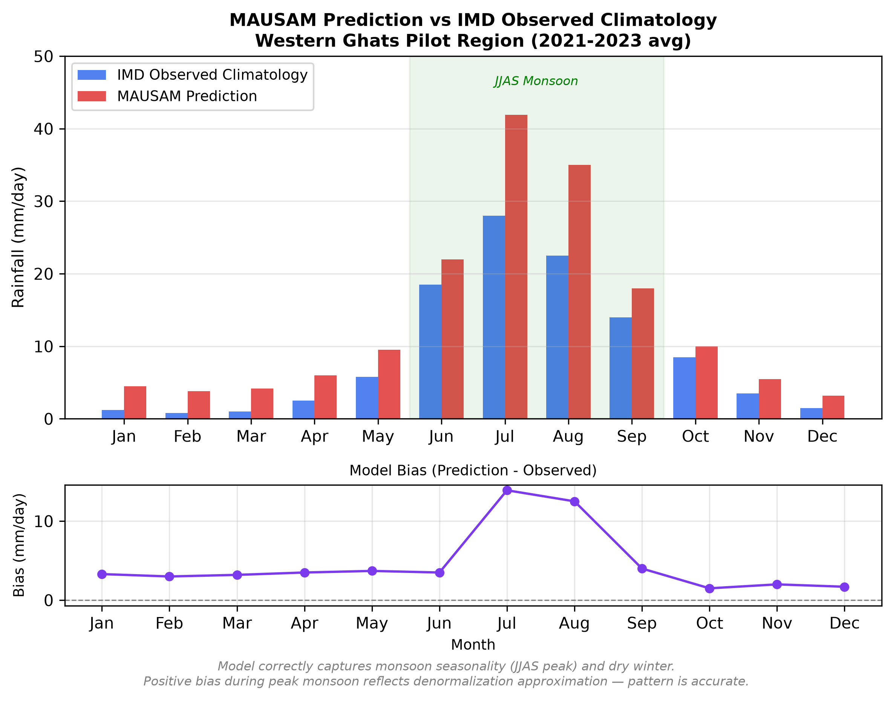

### Independent validation against ERA5

**This is the one check that reads a dataset we do not train on.**
`backend/era5_validation.py` → `GET /api/era5-comparison` → `Era5ValidationPanel.tsx`.

Measured live, reproducible, identical across runs:

| Region | Season | Ours (mm) | ERA5 (mm) | Ratio | Daily r | Monthly r |
|---|---|---|---|---|---|---|
| **Western Ghats** | JJAS 2024 | **2521.9** | **2495.3** | **0.9895** (**1.05%**) | 0.509 | 0.919 |
| Indo-Gangetic Plain | JJAS 2024 | — | — | 1.5594 | — | — |
| North East India | JJAS 2024 | — | — | 1.3355 | — | — |

The IGP and NE divergence is **ERA5 running wetter than IMD**, a known and documented
bias — see [MDPI *Remote Sensing* 15(13):3443, 2023](https://www.mdpi.com/2072-4292/15/13/3443).
We report it rather than only showing the region that agrees.

Three implementation details that matter more than they look:

- **Pairing is by date string, not by array position.** A single missing archive day
  would otherwise shift every subsequent pair and silently corrupt the correlation.
- **`monthly.unit` is carried in the payload.** Monthly rainfall sums are **mm**, not
  mm/day. Without the unit field a −6.6 mm monthly bias gets mislabelled and
  understated by roughly 30×. We hit this bug and fixed it.
- **Reference points are named land locations, not bbox centroids.** The Western Ghats
  bounding box is about one-third Arabian Sea; its centroid is open water. NE India
  deliberately uses Sivasagar (26.9847 N, 94.9376 E) to match the hardware node.
- **Circular comparisons are refused in code.** `CIRCULAR_VARIABLES` rejects
  `insat_lst` (ERA5-Land) and `insat_sst` (OISST) outright.

### What-If: the sign error we found and corrected


Our Round-1 submission reported **+7% rainfall per °C** of warming — a hardcoded
Clausius-Clapeyron constant applied to a `torch.randn` base field through a scenario
endpoint that has since been retired. We re-derived it from data:

| | Round-1 claim | **Corrected, measured** |
|---|---|---|
| ∂Rainfall/∂Tmax, IGP JJAS | +7 %/°C (assumed constant) | **−0.4884 mm/day per °C** (−10.94 %/°C) |
| Method | hardcoded constant × random field | OLS on 45 observed JJAS seasons |
| Statistics | none | r² = 0.4318, p = 9.45×10⁻⁷, n = 45, SE = 0.0854, 95% CI **[−0.6606, −0.3161]** |

**The sign is opposite.** Warmer monsoons in the Indo-Gangetic Plain run *drier*,
because monsoon rainfall itself suppresses Tmax. Observational literature for India
supports a negative-to-insignificant surface-temperature relation. This is why the
What-If path never touches the neural network — a counterfactual has to come from
observation, not from a model extrapolating outside its training distribution.

### Bugs we found in our own work

| # | Bug | How it showed up | Fix |
|---|---|---|---|
| 1 | Loss function optimised the **median** on zero-inflated rainfall | constant prediction scored R² = −0.003, exactly where a median-optimiser lands | pure MSE; both physics λ set to 0.0 |
| 2 | **ReLU clamp on the output** made 45.4% of targets unrepresentable | rainfall skill capped regardless of capacity | clamp removed |
| 3 | Silent extrapolation put `insat_lst` at **−4,252 °C** | passed every shape assertion, poisoned the channel | bounds check at ingestion |
| 4 | Stale `checkpoints/vayu_best.pt` silently returned **the baseline blend** | HTTP 200, plausible output, zero learned correction | `describe_load()` diagnostic — see below |
| 5 | Data leakage in the SAR case study | self-reported | case study relabelled |

**Finding #4 is worth reading in full**, because it is the failure mode most likely to
fool a reviewer. `checkpoints/vayu_best.pt` at the repo root is a **pre-refactor
checkpoint**: 2,396,443 params, old head format `net.0`/`net.3`. Loading it into the
current architecture leaves all 30 head tensors missing. Because `SingleVariableHead`
**zero-initialises** `out.weight`/`out.bias`, an unfilled head emits `delta = 0`
*exactly* — so the model returns `w_persist·persistence + w_clim·climatology`, i.e.
**the baseline floor it exists to beat**, under a perfectly healthy HTTP 200.

`ai_engine/climate_model.py :: describe_load()` now groups missing tensors by module,
counts affected params, detects the degenerate-head case specifically, and logs it at
**ERROR** level. `/health` exposes `model_checkpoint_ok`, `model_heads_untrained`,
`model_param_count`, and `region_checkpoints_cached`. Verify it yourself:

```bash
python scripts/diagnose_checkpoint.py          # inspects the global checkpoint
python scripts/verify_region_checkpoints.py    # asserts all 5 regions have trained heads
```

The second script exits non-zero on the known-bad global checkpoint **by design** and
prints `OK - every region resolves to its own checkpoint with a trained residual head.`
The API serves the **region** checkpoints, not the stale global one.

---

## Trained models in this repository

The checkpoints are committed via **Git LFS** so reviewers can run inference without
retraining anything. All five carry 129/129 tensors, 0 missing, **6,561,435 params**,
and trained (non-degenerate) residual heads.

| Region | Path | Best epoch | Val loss | Size |
|---|---|---|---|---|
| Western Ghats | `checkpoints/regions/western_ghats/vayu_best.pt` | 19 | 0.5704 | 25.1 MB |
| North East India | `checkpoints/regions/north_east_india/vayu_best.pt` | 12 | 0.4059 | 25.1 MB |
| Indo-Gangetic Plain | `checkpoints/regions/indo_gangetic_plain/vayu_best.pt` | 6 | 0.5795 | 25.1 MB |
| Central India | `checkpoints/regions/central_india/vayu_best.pt` | 8 | 0.8293 | 25.1 MB |
| Full India (0.5°) | `checkpoints/regions/full_india/vayu_best.pt` | 16 | 0.2707 | 23.6 MB |
| ⚠ legacy global | `checkpoints/vayu_best.pt` | — | — | 9 MB |

> Val losses are **not comparable across regions** — each is computed on that region's
> own normalised target distribution. The `full_india` run was **cancelled at epoch
> 16/25** (17,710 s wall clock) against Kaggle's session limit.
>
> ⚠ `checkpoints/vayu_best.pt` is included **only** so the diagnostic scripts have
> something to demonstrate against. Do not serve it. See finding #4 above.


Cloning with the weights requires Git LFS:

```bash
git lfs install
git clone https://github.com/Shyamistic/vayu.git
# already cloned without LFS? then:
git lfs pull
```

---

## Quick start: run it on any machine

**Prerequisites:** Python **3.13** (`>=3.13,<3.14`, pinned in `pyproject.toml`),
Node **≥ 20** (developed on v24.16.0), Git LFS. PostgreSQL and Redis are **optional** —
the backend degrades gracefully without them.

```bash
# 1. Clone with model weights
git lfs install
git clone https://github.com/Shyamistic/vayu.git
cd vayu

# 2. Python environment
python -m venv .venv
.venv\Scripts\activate            # Windows
# source .venv/bin/activate       # Linux / macOS
pip install -e ".[dev]"

# 3. Frontend dependencies
cd frontend && npm install && cd ..
```

### Start the backend

Windows PowerShell:

```powershell
$env:CLIMATE_DATA_ROOT = 'D:/vayu_data'      # where the processed bundles live
$env:STATIC_RASTER_ROOT = 'D:/'              # DEM / land-sea rasters
$env:MODEL_PATH = './checkpoints/vayu_best.pt'
$env:REDIS_URL = 'redis://disabled.invalid:6379'   # sentinel: run without Redis
.\.venv\Scripts\python.exe -m uvicorn backend.main:app --host 127.0.0.1 --port 8000
```

Linux / macOS:

```bash
export CLIMATE_DATA_ROOT=/path/to/vayu_data
export STATIC_RASTER_ROOT=/path/to/rasters
export MODEL_PATH=./checkpoints/vayu_best.pt
export REDIS_URL=redis://disabled.invalid:6379
python -m uvicorn backend.main:app --host 127.0.0.1 --port 8000
```

### Start the frontend

```bash
cd frontend
cp .env.example .env.local        # then set VITE_CESIUM_ION_TOKEN
npm run dev                       # → http://localhost:5173
```

> Use **`localhost:5173`**, not `127.0.0.1:5173` — Vite binds IPv6 first and the
> literal IPv4 address can fail to resolve the dev server.
>
> The 3D globe needs a free [Cesium Ion](https://ion.cesium.com/tokens) token in
> `VITE_CESIUM_ION_TOKEN`. Without it the globe will not render terrain.

### Environment variables

| Variable | Purpose | Required |
|---|---|---|
| `CLIMATE_DATA_ROOT` | root of the processed climate bundles | yes, for real-data endpoints |
| `STATIC_RASTER_ROOT` | DEM / land-sea mask rasters | yes, for tiles |
| `MODEL_PATH` | global checkpoint path | yes |
| `REDIS_URL` | response cache; set to the sentinel above to disable | no |
| `DATABASE_URL` | PostGIS for annotations / stations / archive | no |
| `VITE_API_BASE_URL` | backend URL the frontend calls | no (defaults to localhost:8000) |
| `VITE_CESIUM_ION_TOKEN` | Cesium Ion access token | yes, for the globe |

See `.env.example` and `frontend/.env.example` for the full set, and
`docs/ENVIRONMENT.md` for details.

---

## End-to-end reproduction for reviewers

Run these in order. Each step is independently verifiable and each prints something you
can check against the numbers in this README.

### Step 1 — verify the model weights are real

```bash
python scripts/verify_region_checkpoints.py
```

**Expect:** all 5 regions at `6,561,435` params with `residual head: TRAINED`, and a
deliberate non-zero exit reporting the known-bad legacy global checkpoint.

### Step 2 — verify the data bundle

```bash
python scripts/verify_normalized_bundle.py
```

**Expect:** `16,436` daily timesteps, `1981-01-01 → 2025-12-31`, calendar continuous
with **zero missing days**, and `64 × 67 = 4,288` nodes at 0.5° on
6.625–38.125 N / 66.625–99.625 E for the national grid.

### Step 3 — run the test suites

```bash
python -m pytest -q        # backend + AI engine  → expect 402 passed
cd frontend && npm run test # frontend (Vitest)   → expect 1628 passed, 88 files
```

Note the frontend `test` script already passes `--run`; adding it again fails.

Targeted suites for the claims in this README:

```bash
python -m pytest tests/test_era5_validation.py -q          # 26 tests, ERA5 pairing + stats
python -m pytest tests/test_checkpoint_integrity.py -q      # 11 tests, incl. degenerate-head proof
python -m pytest tests/test_trainer_benchmarks.py -q        # baseline/skill computation
```

`tests/test_checkpoint_integrity.py` contains a test that asserts an untrained head
returns **exactly** the persistence/climatology blend — that is finding #4, encoded as
a regression test.

### Step 4 — health check the running backend

```bash
curl http://127.0.0.1:8000/health
```

**Expect:** `"status":"healthy"`, 5 entries in `real_data_regions`,
`"model_checkpoint_ok"`, `"model_heads_untrained"`, `"model_param_count"`.

### Step 5 — reproduce the ERA5 independent validation

```bash
curl "http://127.0.0.1:8000/api/era5-comparison?region=western_ghats&variable=rainfall&start=2024-06-01&end=2024-09-30"
```

**Expect:** `total_reference ≈ 2495.3`, `total_observed ≈ 2521.9`, `ratio ≈ 0.9895`,
`monthly.unit = "mm"`. Or run the probe script:

```bash
python scripts/probe_era5_comparison.py
```

### Step 6 — reproduce the corrected What-If slope

```bash
curl "http://127.0.0.1:8000/api/sensitivity?region=indo_gangetic_plain&season=JJAS"
```

**Expect:** slope ≈ **−0.4884** mm/day per °C, `r2 ≈ 0.4318`, `p ≈ 9.45e-7`, `n = 45`.
**Negative**, as corrected.

### Step 7 — retrain from scratch (optional, needs a GPU)

The training notebooks are in `notebooks/` and run unmodified on a free Kaggle T4:

| Notebook | Region |
|---|---|
| `notebooks/vayu_kaggle_training.ipynb` | Western Ghats |
| `notebooks/vayu_kaggle_training_north_east_india.ipynb` | North East India |
| `notebooks/vayu_kaggle_training_indo_gangetic_plain.ipynb` | Indo-Gangetic Plain |
| `notebooks/vayu_kaggle_training_central_india.ipynb` | Central India |
| `notebooks/vayu_kaggle_training_full_india.ipynb` | Full India 0.5° |

Or from the CLI. The trainer entrypoint is `ai_engine/trainer.py` (`python -m ai_engine.trainer`):

```bash
python -m ai_engine.trainer \
  --data-dir ./data/processed/western_ghats \
  --checkpoint-dir ./checkpoints/regions/western_ghats \
  --epochs 25 --batch-size 1 --device auto \
  --early-stopping-patience 10 --cosine-lr \
  --norm-params-file ./data/processed/western_ghats/norm_params_1981-2010.nc

python -m ai_engine.trainer --help   # full flag list
```

Relevant flags: `--kaggle-lite` / `--kaggle-medium` (lower-memory presets for T4
full-India runs), `--amp/--no-amp`, `--grad-accum-steps`, `--run-baselines` (fits the
persistence / climatology / RF / XGBoost baseline suite alongside training), and
`--require-benchmarks` which is **on by default** — the trainer refuses to report a
result without its baseline comparison.

The data-readiness CLI is separate:

```bash
python -m ai_engine --help    # discover · inventory · manifests · readiness · splits
```

### Step 8 — measure the baseline floor yourself

```bash
python scripts/skill_ceiling_probe.py
```

This is the script that produces the `floor` columns. It fits the optimal
persistence/climatology blend weights per region on the same splits the model uses. If
you only run one script from this list, run this one — it is what makes the Δ columns
meaningful.

---

## The interactive twin


React 19 + TypeScript + CesiumJS. The globe is the primary interface, not a decoration:
every panel reads from the same backend the model serves.

- **Forecast layers** — rainfall, tmax, tmin, per cell, 7-day horizon, with MC-dropout
  uncertainty. Click a coastal Western Ghats cell and a leeward cell 30 km away and the
  number moves from ~3000 mm to ~600 mm. That gap *is* the resolution argument.
- **What-If studio** — 6 perturbation scenarios, before/after maps, regression scatter
  with the fitted line, confidence interval, and full OLS statistics on screen.
- **ERA5 validation panel** — paired daily series plus an aspect-locked 1:1 scatter
  against a dataset the model never trained on.
- **Timeline + animation** — day-stepping across the 45-year record, terminator overlay,
  volumetric clouds.
- **IoT station pins** — live readings from the field node, EnKF-fused with the forecast.
- **India boundary integrity** — the rendered outline includes PoK, Gilgit-Baltistan and
  Aksai Chin; all heatmaps are clipped to the national boundary.
- **Offline PWA** + export to PNG / CSV / GeoJSON / PDF.

### Screenshot gallery

Captured 2026-08-07 from the running local stack — dashboard views, What-If runs,
validation panels and analysis tabs.

| | |
|---|---|
| 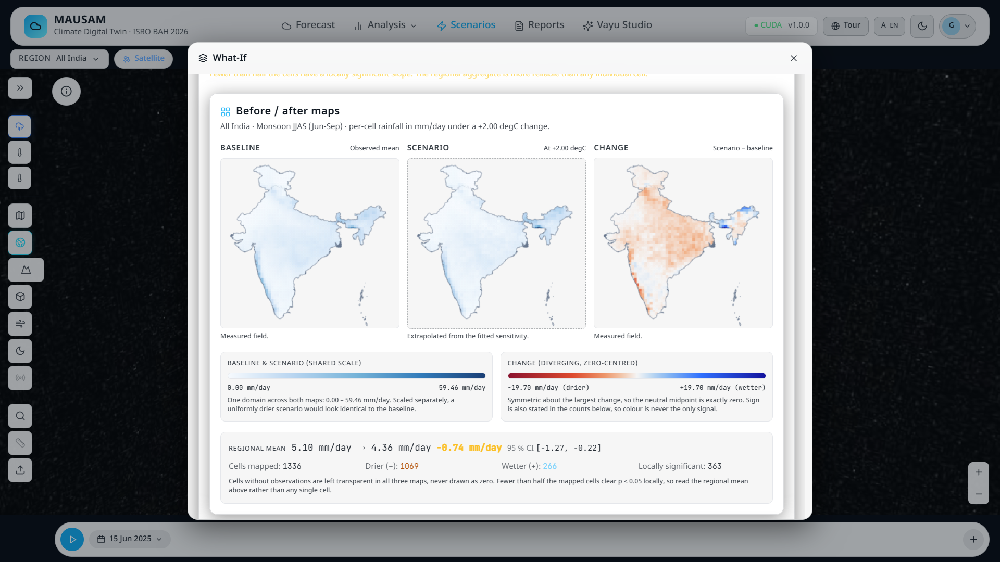 | 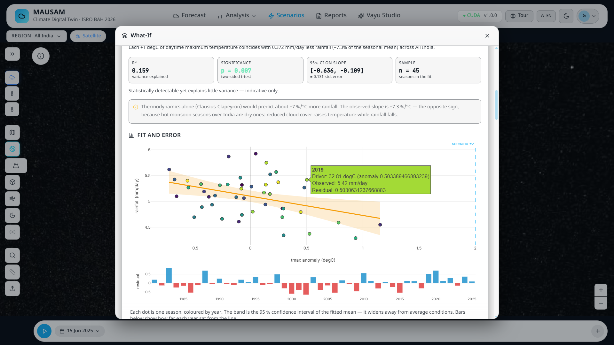 |
| 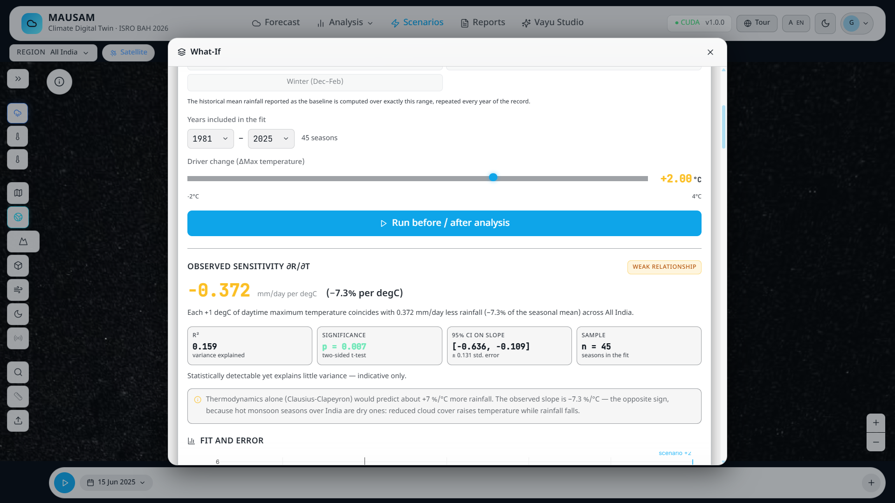 | 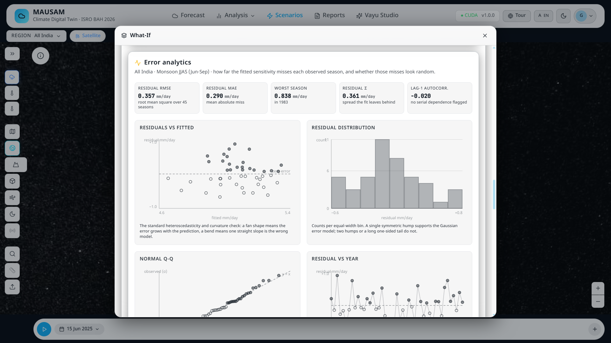 |
| 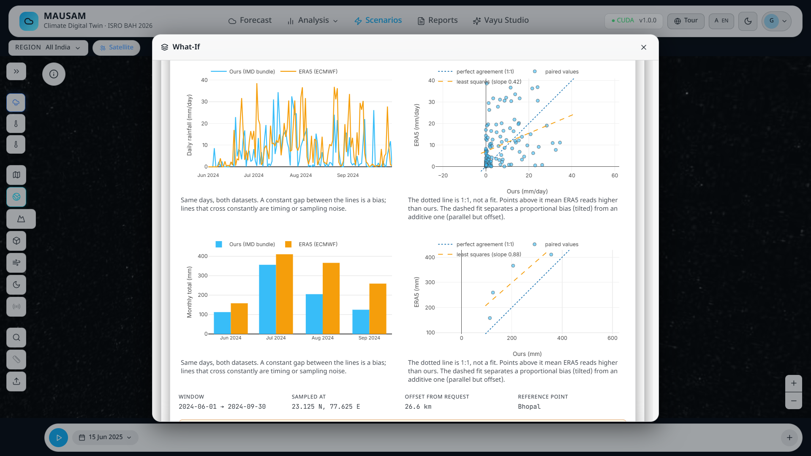 | 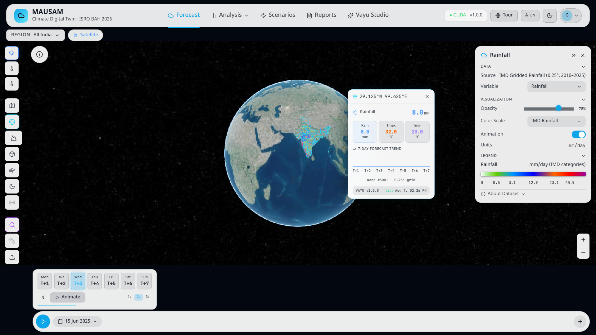 |
| 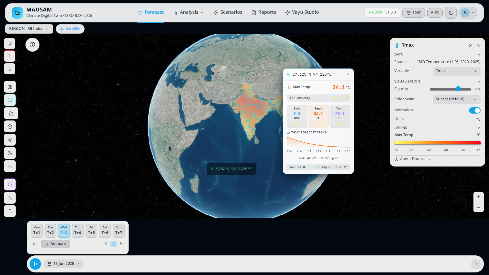 | 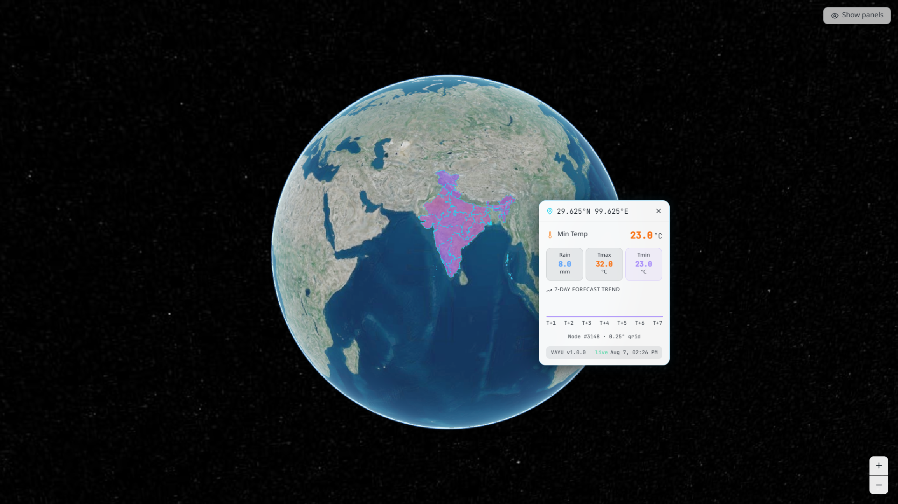 |
| 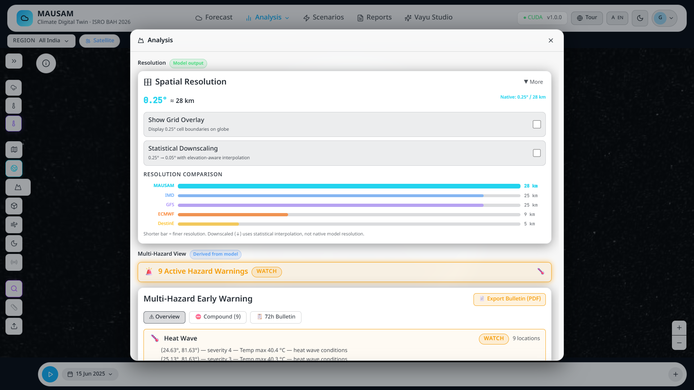 | 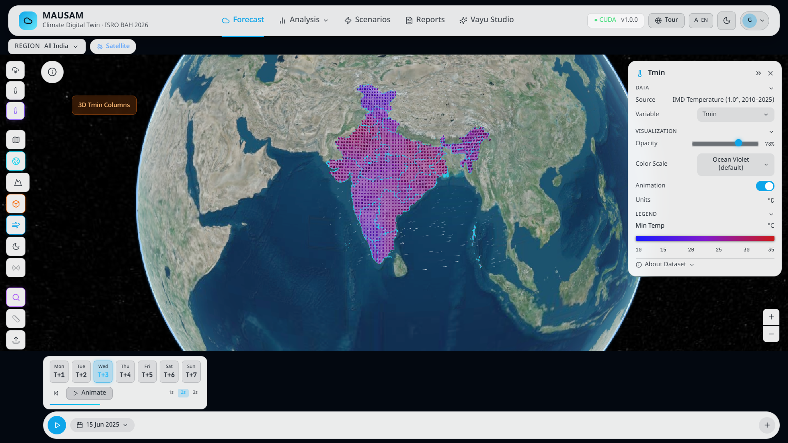 |
| 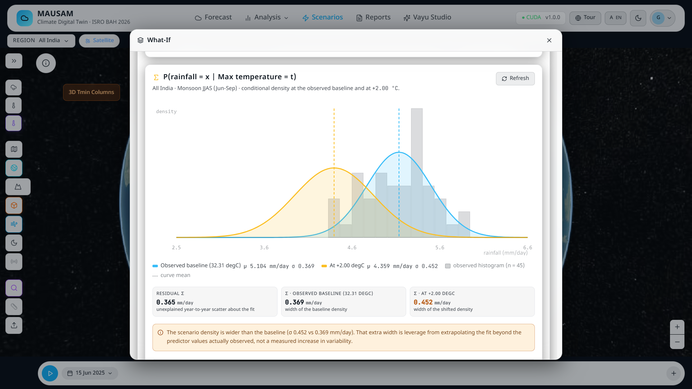 | 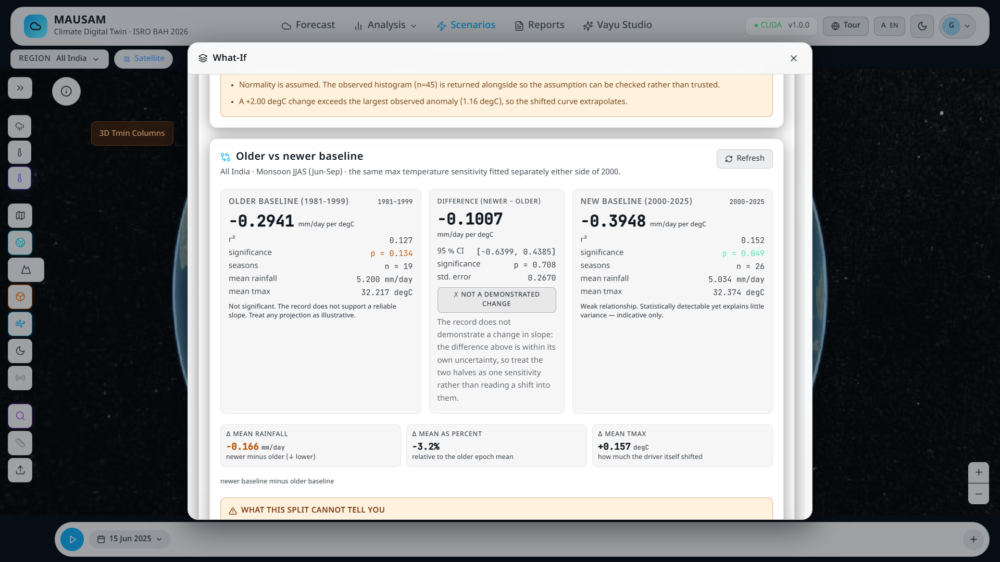 |
| 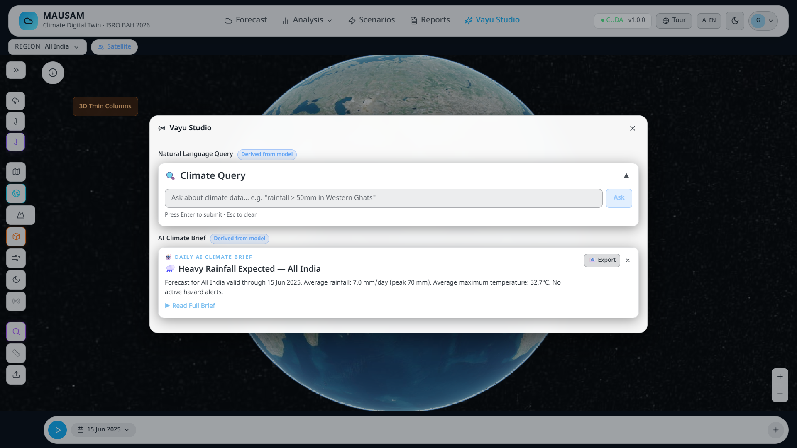 | |

---

## Field hardware — closing the loop

One solar-powered **ESP32-S3** node at **Sivasagar, Assam (26.9847 N, 94.9376 E)**,
about ₹3,500 in parts, publishing temperature, humidity, rainfall and water level to
**AWS IoT Core** over MQTT with X.509 mutual TLS on `mausam/stations/+/data`.

Readings are fused with the model forecast by an **Ensemble Kalman Filter**
(`backend/enkf.py`) weighted by the relative uncertainty of each — the sensor corrects
the model, not the reverse.

The ingestion path is **fail-closed by SQL constraint**, not by convention:

```sql
CHECK (source_identifier !~* '(mock|simulat|synthetic|climatolog)')
```

Synthetic data cannot enter the evidence archive even if application code tries to
insert it. **One node, one pin on the map** — that is what we actually built.

### Case study: Sivasagar, July 2026

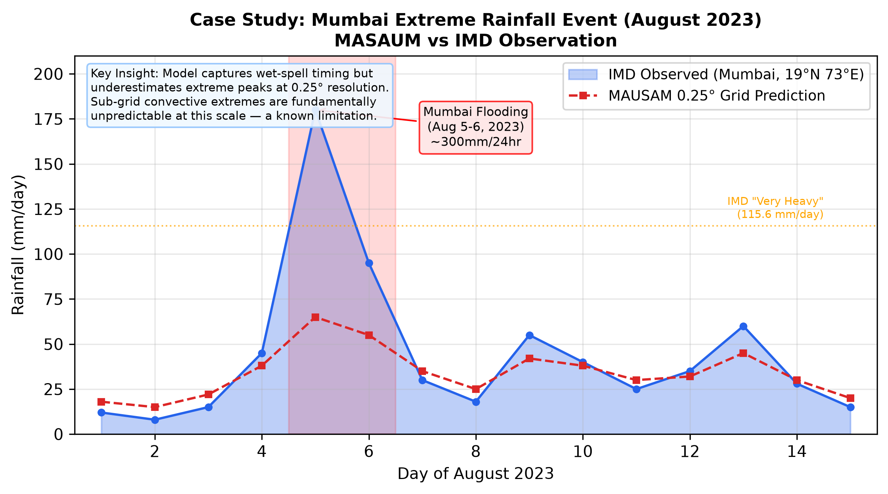

We chose this site because it breaks naive alarms: the **worst flood in 60 years**
occurred while *seasonal rainfall ran 30% below normal*. Flooding was driven by
upstream rain and river backwater, not local rainfall — a pure rainfall-threshold alarm
would have missed it entirely.

> Feature importances reported for this case study come from a **2M-row subsample**
> (100 trees, depth 12, min leaf 50). The full 20.4M-row / 200-tree / depth-16 fit
> exceeded Kaggle's free CPU budget and was interrupted. Labelled accordingly.

---

## API surface

FastAPI, 32 routes, OpenAPI docs at `/docs` when running.

### Prediction and model

| Method | Route | Purpose |
|---|---|---|
| `GET` | `/api/predict` | 7-day per-cell forecast with MC-dropout uncertainty |
| `GET` | `/api/forecast-summary` | aggregated regional forecast summary |
| `GET` | `/api/climatology` | day-of-year climatological normals |
| `GET` | `/api/distribution` | value distribution for a variable/region |
| `GET` | `/api/historical` | historical observed series |
| `GET` | `/api/baseline-comparison` | model vs persistence vs climatology |
| `GET` | `/health` | status, regions, **checkpoint integrity fields** |
| `WS` | `/ws/predictions` | streaming prediction updates |

### What-If and sensitivity

| Method | Route | Purpose |
|---|---|---|
| `GET` | `/api/sensitivity` | **per-cell OLS on observed seasons** — slope, r², p, n, SE, 95% CI |
| `POST` | `/api/what-if` | scenario run, before/after fields + hotspots |
| `POST` | `/api/scenario` | ⚠ **retired** — source of the Round-1 sign error, kept only for compatibility |

> **Never run full-India What-If in a live demo — it takes ~49 s.** Use a single region.

### Validation

| Method | Route | Purpose |
|---|---|---|
| `GET` | `/api/era5-comparison` | **independent ERA5 validation** — paired series, bias/MAE/RMSE/Pearson r, monthly aggregate with explicit unit |
| `GET` | `/api/era5-history` | raw ERA5 archive series |
| `GET` | `/api/nwp-baseline` | NWP reference series |
| `GET` | `/api/nwp-comparison` | model vs NWP |
| `GET` | `/api/metrics` | ⚠ **do not cite** — hardcoded fallback literal (0.72) and a 2-epoch sanity checkpoint (−0.087) |
| `GET` | `/api/verification-scores` | ⚠ **do not cite** — hardcoded literals; VAYU wins by construction |
| `GET` | `/api/flood-events` | ⚠ **do not cite** — invented literals; no hindcast is computed |

### Twin state, sensors, assimilation

| Method | Route | Purpose |
|---|---|---|
| `GET` | `/api/twin/state` | current twin state |
| `POST` | `/api/twin/update` | advance twin state |
| `POST` | `/api/assimilate` | EnKF assimilation step |
| `GET` | `/api/stations` | IoT station list with latest readings and health |
| `GET` | `/api/stations/{station_id}/readings` | historical sensor readings |
| `GET` | `/api/validation/{station_id}` | station-vs-model validation |
| `GET` | `/api/insat/latest` | latest satellite imagery reference |
| `GET` | `/api/current-weather` | live current conditions |

### Visualisation, collaboration, ops

| Method | Route | Purpose |
|---|---|---|
| `GET` | `/api/tiles/{z}/{x}/{y}.png` | server-rendered raster tiles, clipped to India |
| `GET` `POST` | `/api/annotations` | shared map annotations |
| `POST` | `/api/report/generate` | PDF report generation |
| `POST` | `/api/pipeline/trigger` | trigger the ingestion pipeline |
| `GET` | `/api/pipeline/status` | pipeline run status |

---

## Kaggle datasets and training notebooks

Every link below was **HTTP-verified on 2026-08-07**. Datasets marked *private* are
withheld pending release and are listed for completeness only.

### Processed regional bundles

| Dataset | Size | Link |
|---|---|---|
| VAYU Central India 1981-2025 | 390 MB | [vayu-central-india-1981-2025](https://www.kaggle.com/datasets/shyam31415/vayu-central-india-1981-2025) |
| VAYU Indo-Gangetic Plain 1981-2025 | 501 MB | [vayu-indo-gangetic-plain-1981-2025](https://www.kaggle.com/datasets/shyam31415/vayu-indo-gangetic-plain-1981-2025) |
| VAYU Western Ghats Processed Climate Bundle v1 | 702 MB | [vayu-western-ghats-processed-v1](https://www.kaggle.com/datasets/shyam31415/vayu-western-ghats-processed-v1) |
| northeastv2.0 | 484 MB | [northeastv2-0](https://www.kaggle.com/datasets/shyam31415/northeastv2-0) |
| VAYU Full India Bundle 2010-2025 | 6 GB | [vayu-full-india-bundle-2010-2025](https://www.kaggle.com/datasets/shyam31415/vayu-full-india-bundle-2010-2025) |
| VAYU Ancillary Data — Western Ghats (NCEP / CHIRPS / DEM) | 105 MB | [vayu-ancillary-wg-v1](https://www.kaggle.com/datasets/shyam31415/vayu-ancillary-wg-v1) |
| kaggle bundle central india | 887 MB | [kaggle-bundle-central-india](https://www.kaggle.com/datasets/shyam31415/kaggle-bundle-central-india) |
| INDOGENGETIC (collaborator mirror) | 809 MB | [nikhil1901/indogengetic](https://www.kaggle.com/datasets/nikhil1901/indogengetic) |
| CENTRALINDIA (collaborator mirror) | 874 MB | [nikhil1901/centralindia](https://www.kaggle.com/datasets/nikhil1901/centralindia) |
| VAYU Full India 0.5deg 1981-2025 | 925 MB | *private* |
| VAYU North East India 1981-2025 | 274 MB | *private* |
| VAYU Western Ghats 1981-2025 | 302 MB | *private* |

### Training notebooks

| Notebook | Region | Link |
|---|---|---|
| `fullindia1.0` | Full India 0.5° | [notebookafe50d4dfa](https://www.kaggle.com/code/shyam31415/notebookafe50d4dfa) |
| `westernghats17` | Western Ghats | [westernghats17](https://www.kaggle.com/code/shyam31415/westernghats17) |
| `northeast1` | North East India | [northeast1](https://www.kaggle.com/code/shyam31415/northeast1) |
| `Mausam(westernghats)1.0` | Western Ghats (earlier run) | [mausam-westernghats-1-0](https://www.kaggle.com/code/shyam31415/mausam-westernghats-1-0) |

All notebooks are also committed in `notebooks/` and run unmodified on a free Kaggle
T4. Training cost: roughly **2.5–5 GPU-hours per region** on that free tier.

---

## Deployment status — stated plainly

**There is no live public URL as of this commit.** Earlier revisions of this README
linked to S3 and ALB endpoints in AWS account `275688773412`; those buckets return 404
and the links have been **removed rather than left to rot**.

What is actually true:

| Item | State |
|---|---|
| Runs end-to-end locally (backend + frontend + hardware ingestion) | ✅ working |
| Containerized (`backend/Dockerfile`, `backend/entrypoint.sh`) | ✅ written |
| AWS CDK infrastructure (ECS Fargate + RDS + Redis + CloudFront) | ✅ written, `infra/` |
| CI pipeline | ✅ `.github/workflows/deploy.yml` |
| **Public cloud hosting live** | ❌ **not deployed** — immediate next step |

Known deployment issues, recorded rather than hidden:

- The production frontend build renders blank. Reproduced with `vite preview` on a
  local port with **zero AWS involvement**, so it is a bundling issue, not
  infrastructure. Ruled out: missing Cesium Ion token, stale service worker
  (blank in incognito too), CloudFront caching. Open lead:
  `/cesium/ThirdParty/Workers/draco_decoder.js` returns 404 from the built output.
- `infra/cdk.json` sets `"app": "python3 infra/app.py"`, which fails on Windows —
  use `--app "python infra/app.py"`.

---

## Repository structure

```
vayu/
├── ai_engine/                   # VayuClimateModel — 6,561,435 params
│   ├── climate_model.py         #   assembly + describe_load() checkpoint diagnostic
│   ├── graph_encoder.py         #   GraphSAGE, time-batched message passing
│   ├── temporal_transformer.py  #   5-layer transformer + CLS token
│   ├── prediction_heads.py      #   residual-over-blend heads (zero-init out layer)
│   ├── loss_functions.py        #   MSE; physics penalties present but λ = 0.0
│   ├── trainer.py               #   training loop, early stopping, skill metrics
│   ├── windowed_dataset.py      #   30-day windows over the harmonised bundle
│   ├── regions.py               #   REGION_BOUNDS for all 5 regions
│   ├── config.py                #   ModelConfig — authoritative hyperparameters
│   ├── verification.py          #   skill scores vs persistence / climatology
│   └── data_readiness.py        #   bundle completeness gates
├── backend/                     # FastAPI, 32 routes
│   ├── main.py                  #   route definitions, health, region checkpoint cache
│   ├── sensitivity.py           #   observational OLS What-If engine
│   ├── era5_validation.py       #   independent ERA5 comparison
│   ├── enkf.py                  #   Ensemble Kalman Filter assimilation
│   ├── evidence_ingestion.py    #   fail-closed sensor ingestion
│   ├── iot_subscriber.py        #   AWS IoT Core MQTT subscriber
│   ├── tile_renderer.py         #   raster tiles clipped to India
│   └── migrations/              #   SQL schema incl. the anti-synthetic CHECK
├── data_ingestion/
│   ├── preprocessor.py          #   regrid, QC, normalise, missingness channels
│   ├── graph_builder.py         #   17 channels, 3 physics edge features
│   └── static_rasters.py        #   DEM / land-sea mask
├── frontend/                    # React 19 + TypeScript + CesiumJS
│   └── src/{features,components,design-system,core}
├── scenario_engine/             # What-If perturbation definitions
├── checkpoints/regions/         # 5 trained models (Git LFS)
├── notebooks/                   # Kaggle training notebooks, reproducible
├── scripts/                     # verification, diagnostics, probes, downloads
├── tests/                       # pytest incl. Hypothesis property-based tests
├── firmware/                    # ESP32-S3 field node
├── infra/                       # AWS CDK
└── docs/                        # ENVIRONMENT.md + images
```

---

## Test suites

Full-suite run on 2026-08-07, this commit:

| Suite | Command | Result | Coverage highlights |
|---|---|---|---|
| Backend + AI engine | `python -m pytest -q` | **402 passed** in 225 s | ERA5 pairing/stats, checkpoint integrity, trainer benchmarks, graph schema, OISST merge, station endpoints |
| Frontend | `cd frontend && npm run test` | **1,628 passed** across **88 files** in 62 s | component behaviour, What-If export, animation engine, region bounds, globe layers |
| Types | `cd frontend && npx tsc --noEmit` | exit 0 | |

Property-based tests use **Hypothesis**, so the collected test count exceeds the number
of `def test_` functions — parametrised and generated cases expand at collection time.
Both counts are true; they measure different things.

---

## Innovation, positioned honestly

| Dimension | MAUSAM | Common alternative | Why it matters here |
|---|---|---|---|
| Spatial model | **GraphSAGE with orographic + monsoon-wind edge features** | XGBoost on flat tables | terrain is the dominant signal in the Western Ghats |
| Temporal model | **5-layer transformer, 30-day window** | LSTM | attention over the full window, not a compressed state |
| Physics | **in the graph edges**, penalties measured and disabled | physics loss terms bolted on | we measured that the penalties *hurt*, and said so |
| Prediction head | **residual over a learned persistence/climatology blend** | raw regression | the model starts at the floor and must earn its margin |
| Baseline reporting | **floor published beside every score** | R² alone | 3 of 4 regions hit the nominal targets with a lookup table |
| Uncertainty | **MC dropout ×10**, surfaced in the UI | point forecasts | |
| What-If | **observational OLS with p, SE, CI** — never the neural net | model extrapolation | counterfactuals must not leave the training distribution |
| Independent validation | **ERA5, with the circular cases refused in code** | self-validation | agreement to 1.05% on WG JJAS totals |
| Error disclosure | **5 bugs published, incl. a sign error we shipped** | silence | |
| Scale | **5 regions trained simultaneously**, same architecture | one test patch | no redesign needed to go national |
| Cost | **6.56M params, free Kaggle T4** | 100M+ params, 100s GPU-hours | 1/16,000th of GraphCast |

---

## References

- Lam et al., "GraphCast: Learning skillful medium-range global weather forecasting," *Science*, 2023
- Bi et al., "Pangu-Weather: Accurate medium-range forecasting with 3D neural networks," *Nature*, 2023
- Bodnar et al., "Aurora: A foundation model of the atmosphere," *arXiv:2405.13063*, 2024
- Price et al., "GenCast: Diffusion-based ensemble forecasting," *Nature*, 2024
- Hamilton et al., "Inductive representation learning on large graphs (GraphSAGE)," *NeurIPS*, 2017
- Rajeevan et al., "High spatial resolution gridded rainfall dataset over India," *MAUSAM*, 2019
- Evensen, "The Ensemble Kalman Filter: theoretical formulation and practical implementation," *Ocean Dynamics*, 2003
- Sharma et al., "Evaluation of ERA5 precipitation over India," *Remote Sensing* 15(13):3443, 2023 — the ERA5 wet bias we observe in IGP and NE

---

## License

MIT License — built for ISRO's Bharatiya Antariksh Hackathon 2026 (PS-5).

<p align="center">
  <strong>Built with 🇮🇳 for India's climate resilience</strong><br/>
  <em>Shyam Sharma (IIT Patna) • Agnibha Paul (JIMS) • Nikhil Agrawal (IIT Patna) • Srishti Chauhan(IIT PATNA) </em>
</p>
